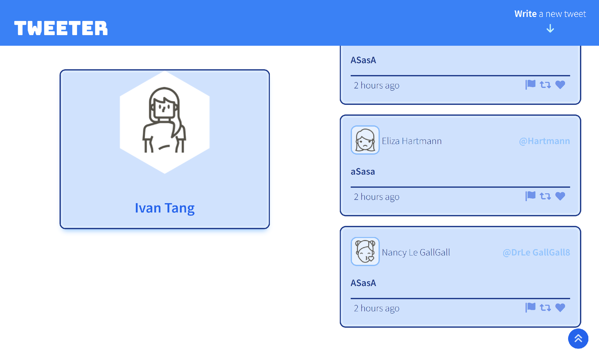
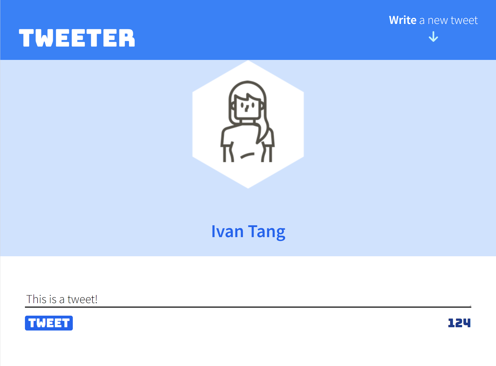

  

  <h3 align="center">Tweeter Project</h3>

  

   Tweeter is a simple, single-page Twitter clone.
  

  
Table of Contents

  <ul>
    <li>
      <a href="#about-the-project">About The Project</a>
      <ul>
        <li><a href="#demo-screenshots">Demo Screenshots</a></li>
      </ul>
      <ul>
        <li><a href="#dependencies">Dependencies</a></li>
      </ul>
    </li>
    <li>
    <a href="#features">Features</a>
    </li>
    <li>
    <a href="#getting-started">Getting Started</a>
    </li>
  </ul>

# About The Project
This repository is the starter code for the project: Students will fork and clone this repository, then build upon it to practice their HTML, CSS, JS, jQuery and AJAX front-end skills, and their Node, Express back-end skills.
 

## Demo Screenshots

 

### Dependencies
* [Node 5.10.x or above](https://nodejs.dev/)
* [Express](https://expressjs.com/)
* [chance](https://www.npmjs.com/package/chance)
* [body-parser](https://www.npmjs.com/package/body-parser)

# Features
* Tweet Compose
* Realtime Tweeting
* Responsive Design

# Getting Started

1. [Create](https://docs.github.com/en/repositories/creating-and-managing-repositories/creating-a-repository-from-a-template) a new repository using this repository as a template.
2. Clone your repository onto your local device.
3. Install dependencies using the `npm install` command.
3. Start the web server using the `npm run local` command. The app will be served at <http://localhost:8080/>.
4. Go to <http://localhost:8080/> in your browser.
